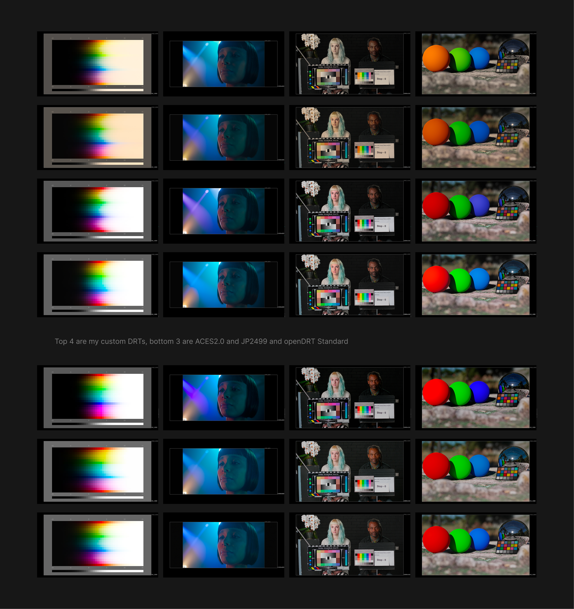

# authored-DRTs

Authored OCIO display-rendering families built around OpenDRT v1.1 and JP2499DRT, with a lean set of supporting color-management infrastructure.

This repository is intended as a practical creative (heavily authored and personally biased) display config rather than a neutral color-management option. I've made something pleasant for my eyes/direction and it'll hopefully be pleasant for yours as well.

Simply said for 3D artists, you get an IPR with a close to final grade or it can even be used as the final if you desire so.

Will most likely be evolving this in the future based on explorations and deleting stuff as I'll get bored from it.

(Thinking about a way to share the DRT presets if anyone wanted to tweak them further for their liking)

## What This Is

`authored-DRTs` contains a slim OCIO v2 config centered on:

- An authored OpenDRT family with multiple creative branches
- An authored JP2499DRT family with custom variants
- Non-neutral display-rendering views
- Common camera/log input spaces
- ACES interchange spaces (for pipe sanity, make it ACEScg config yourself if you want to)
- Texture/data utility spaces with aliases

The config is currently built for a scene-linear Rec.2020 working space and exposes display views for:

- sRGB
- Display P3
- Rec.1886
- Log utility views



## Included Config

Use:

```text
config-2020.ocio
```

The active display-rendering views are intentionally curated. The authored OpenDRT family starts with Flawed Emulsion, then Bleached, Gentle Touch, Shifted Crisp, and OpenDRT Standard, followed by the authored JP2499DRT family.

## Authored OpenDRT Family

All views in this section are intentionally authored display responses rather than neutral technical transforms. The descriptions below summarize the intended image character of each one.

### Flawed Emulsion

A D65 photographic response with dense color separation, imperfect neutrality, and a deliberately unstable emulsion character.

### Flawed Emulsion - Mineral Fade

A restrained atmospheric variant with oxidized aqua and green lower values and warmer aged highlights.

### Flawed Emulsion - Chemical Veil

A darker, denser variant with cool shadow structure, controlled warm upper values, and a chemically contaminated feel.

### Flawed Emulsion - Spilled

The most explosive variant. Bright, saturated, blue and purple biased, with deliberately unstable color behavior.

### Flawed Emulsion 2

An experimental alternate base response with stronger chromatic separation and more scene-dependent behavior.

### Bleached

A D55 response with harder separation, firmer contrast, and a more processed print character.

### Bleached - Negative Print

A forceful negative-print interpretation with increased density, stronger contrast, and a cool magenta bias.

### Bleached - Oxide Residue

An extreme chemical variant with heavy blue separation, disrupted green and yellow relationships, and aggressive chromatic density.

### Gentle Touch

A D50 response with softer highlight handling, gentler tonal compression, and a warmer, more forgiving photographic character.

### Gentle Touch - Negative Print

The Negative Print treatment filtered through the softer Gentle Touch base response.

### Gentle Touch - Surreal Push

An aggressive stylized response with strong blue displacement, elevated saturation, and deliberately surreal tonal behavior.

### Shifted Crisp

A D65 response designed as a more authored and immediately finished-looking alternative to a standard neutral base DRT. It remains comparatively controlled, but uses firmer separation, cleaner tonal organization, and a deliberate overall image bias.

### OpenDRT Standard

The D65 OpenDRT reference response, retained as the baseline for comparison with the authored views.

`OpenDRT Standard` keeps the OpenDRT name explicitly because it is the reference/base view. Custom variants omit the `OpenDRT` prefix in the visible view name to keep menus cleaner.

## Authored JP2499DRT Family

The JP2499DRT family consists of the following authored variants:

- `JP2499DRT`
- `JP2499DRT - Editorial Split`
- `JP2499DRT - Hard Contrast`
- `JP2499DRT - Photochemical`
- `JP2499DRT - Chemical Drift`
- `JP2499DRT - Tarnished Print`
- `JP2499DRT - Graphite Matte`
- `JP2499DRT - Soot`
- `JP2499DRT - Carbon Plate`
- `JP2499DRT - Carbon Black`
- `JP2499DRT - Blue Carbon Print`
- `JP2499DRT - Funeral Bronze`
- `JP2499DRT - Phoenix Drift`

Older STP LUT definitions are intentionally kept in the config for compatibility and future reference, even when not exposed as active views.

## Authoring Notes

The custom OpenDRT looks are authored as display-rendering variants, not generic looks layered after display output. Their creative transforms are placed before the matching final OpenDRT display LUT.

For OpenDRT variants:

- Do not chain multiple DRT LUTs.
- Do not add sRGB, Display P3, Rec.1886, gamma, or other display transforms after the final OpenDRT LUT.
- If adding scene-linear CDL work, wrap only that section in the intended scene-linear space and return to the display-rendering path before the final LUT.

## Sources And Credits

This config is built from and inspired by work from:

- [OpenDRT / open-display-transform by Jedypod](https://github.com/jedypod/open-display-transform)
- [Juan Pablo Zambrano DRT / DCTL work](https://github.com/JuanPabloZambrano/DCTL)
- [ACES OCIO configs](https://github.com/AcademySoftwareFoundation/OpenColorIO-Config-ACES/releases/)
- Camera/log transform references from ARRI, Sony, RED, Canon, Blackmagic Design, DJI, GoPro, Apple, and related vendor resources

## Status

This is a personal authored DRT config. Expect changes as looks are tested, renamed, hidden, or removed.

The goal is not to preserve every experiment. The goal is a small, useful set of authored display responses that feel intentional.
